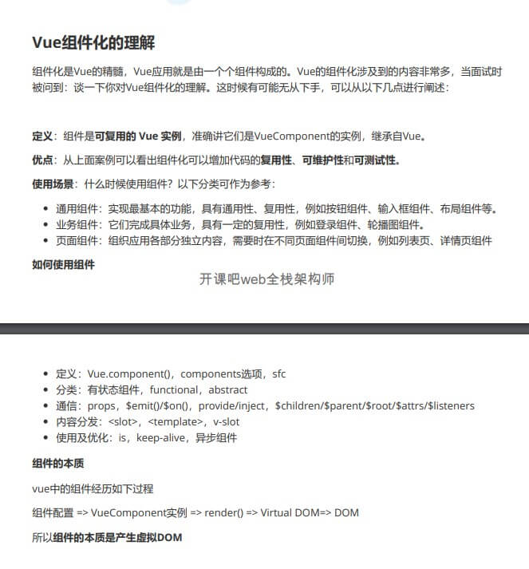

# 1.关于Vue全家桶以及原理

## Question  

### 1. vue-router 这个插件里面需要做什么？

### 2. 为什么要在配置项(main.js)中加入 router 实例？

### 3. 为什么要用 router-view？

### 4. 页面跳转为什么只是刷新内容，而不刷新页面？

### 5. render 函数的使用 和 Vue.component 下的 props 属性

### 6. this.$slots.default 代表的含义

* 用来以编程方式访问通过插槽分发的内容。每个具名插槽都有对应的 property(如：v-slot：foo 中的内容，可以通过 this.$slot.foo() 中找到)。``default`` 这个 property 包含了所有没有被包含在具名插槽中的节点，或者 v-slot:default 的内容。

### 7. mixin 混入模式(Vue3 已废弃)

* vue.mixin({})

### 8. vue 和 vue-router 为什么是强相关的？

* Vue.util.defineReactive

# 2. 关于 Vue 的基础知识补充

## 1. Vue 通过 slot 插槽进行内容分发和事件处理

``` html
<body>
  <message :show.sync="show">消息提示，success！</message>
</body>
<script>
  // 具体例子可以看当前目录下的 HelloWorld 组件
  Vue.component('message', {
    props: ['show'],
    template: `
      <div class="message-view" v-if="show">
        // slot可理解为占位符，内容如何，通过标签内容去定 
        <slot></slot>
        <button class="close-message" @click="$emit('update:show', false)">关闭弹窗</button>
      </div>`
  });
  
  new Vue({
    data() {
      return {
        show: false
      }
    },
    methods: {

    }
  })
</script>
```  

## 2. Vue 组件化的理解



## 3. Vue 数据相关 API

### 1. set/$set

* 向 **响应式** 对象中添加一个属性，并确保这个新的属性同样也是响应式的，并且触发视图更新。
* 使用方式：Vue.set(target, propertyName/index, value)
* 参数说明：target：新添加的属性；propertyName/index: 对象中的key或者是数组中的下标；value：新的值

### 2. delete/$delete

* 删除对象的属性，如果对象是响应式的，确保能够去触发视图更新。
* 使用方法： Vue.delete(target, propertyName/index)

## 4. Vue 事件相关 API

### 1. vm.$emit

* 触发当前实例上的事件。参数都会传给监听器回调

``` javascript
vm.$emit('test', 'name');
```

### 2. vm.$on

* 监听当前实例上的自定义事件。事件可以由 ``vm.$emit`` 触发。回调函数会接收所有传入事件触发函数的额外参数

``` javascript
vm.$on('test', (res)=>{
  console.log(res);
})
```

### 3. vm.$once

* 监听一个自定义事件。但是只触发一次，触发之后，监听器就会被移除。

``` javascript
vm.$once('test', (res)=>{
  console.log(res);
})

```

## 5. Vue 节点相关 API

### 1. ref 和 $refs

* ref 是写在元素节点上的，$refs是去获取节点
* $refs 不是响应式的。
* 在 v-for 用于元素或者组件的时候，$refs 获取到的信息将是包含DOM节点或者组件实例的数组。

## 6. 渲染函数 ``render``

``` javascript
render: function(createElement) {
  // createElement 函数返回的结果是 VNode
  return createElement(
    tag, // 标签名称
    data, // 传递数据
    children, // 子节点数组
  )
}

Vue.component('heading', {
  render(h) {
    // h 指的是一个生成 虚拟DOM 的方法
    return h()
  }
})
```