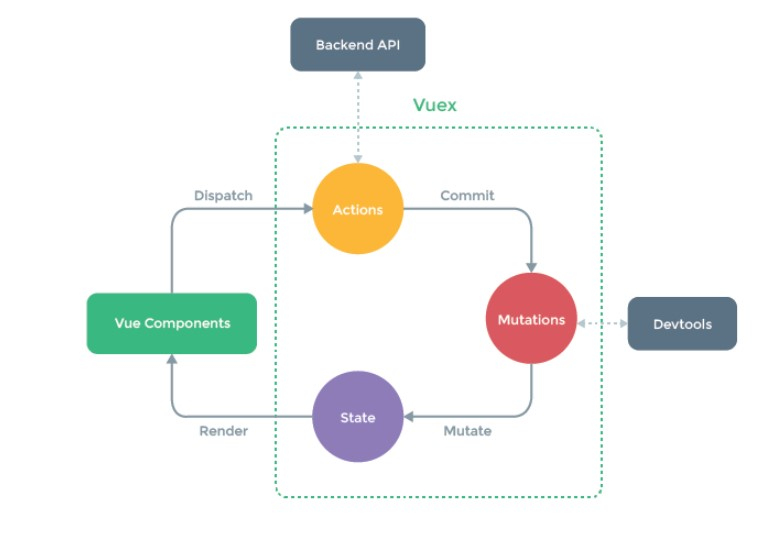

# 1. 什么是 Vuex ?

- Vuex 是一个专为 Vue.js 应用程序开发的状态管理模式 + 库。它采用集中式存储管理应用的所有组件的状态，并以相应的规则保证状态以一种可预测的方式发生变化。

* 单例模式 + 单向数据流
  

# 2. 基础

```javascript
export default new Vuex.Store({
  // 全局的状态
  state: {},
  // 变更 state
  // 在组件中，通过 commit 提交更改在调用mutations
  // this.$store.commit()
  mutations: {},
  // action 是类似于 mutation，但不同在于：
  // 1. action 提交的是 mutation，而不是直接去变更状态
  // 2. action 可以包含任意的异步操作
  actions: {},
});
```
